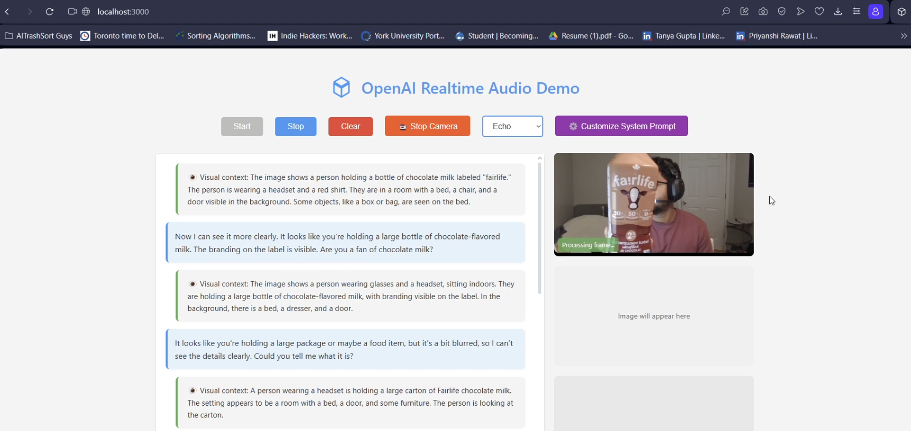
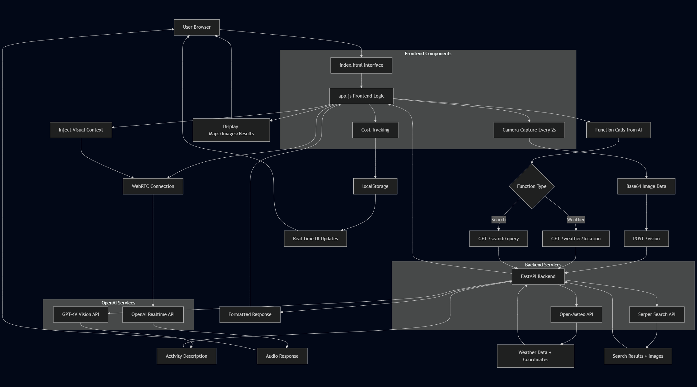

# Conversation and Detection Agent



A real-time conversational AI agent that combines OpenAI's GPT-4o realtime audio capabilities with computer vision for dementia care assistance. This system guides users through tea-making activities using voice interaction and visual observation.

## What This Project Does

This application serves as a caring video assistant that helps individuals with dementia through tea-making activities by:

- **Voice Interaction**: Real-time audio conversation using OpenAI's GPT-4o realtime API
- **Visual Monitoring**: Continuous camera feed analysis to detect tea-making steps and anomalies
- **Gentle Guidance**: Provides warm, encouraging feedback and step-by-step assistance
- **Anomaly Detection**: Identifies missing steps, repetitive actions, long pauses, or out-of-order actions
- **Additional Features**: Weather information, web search, and interactive maps

## Architecture and Data Flow

The system consists of three main layers that work together to create a seamless conversational experience:

### System Flow Overview

```
User Actions (Speech + Tea-making) 
    ↓
Frontend (Browser)
    ↓
Backend (FastAPI Server)
    ↓
External APIs (OpenAI, Open-Meteo, Serper)
    ↓
Response Processing
    ↓
User Experience (Audio + Visual Feedback)
```

### Complete System Architecture



### Detailed Component Connections

**1. User Interface Layer (index.html + app.js)**
The frontend handles all user interactions and coordinates the data flow:

- **Audio Capture**: Microphone input goes directly to OpenAI via WebRTC connection
- **Camera Feed**: Browser captures video frames every 2 seconds, converts to base64, sends to `/vision` endpoint
- **User Controls**: Start/stop buttons, voice selection, camera toggle all managed locally
- **Display Management**: Shows conversation history, weather maps, search results, and cost tracking

**2. Backend Coordination Layer (app.py)**
The FastAPI server acts as the central hub connecting different services:

- **Session Endpoint** (`/session`): Takes voice preference and system prompt, creates OpenAI realtime session, returns ephemeral token
- **Vision Endpoint** (`/vision`): Receives base64 image, sends to GPT-4V, returns description of tea-making activity
- **Weather Endpoint** (`/weather/{location}`): Gets coordinates from geocoding API, fetches weather from Open-Meteo, formats response
- **Search Endpoint** (`/search/{query}`): Queries Serper API for web results and images, returns formatted data

**3. External API Integration**
Multiple APIs work together to provide comprehensive assistance:

- **OpenAI Realtime API**: Direct WebRTC connection for audio streaming and conversation
- **OpenAI Vision API**: Processes camera frames to understand user actions
- **Open-Meteo API**: Provides weather data and coordinates for location-based information
- **Serper API**: Enables web search functionality with image results

### Data Flow Walkthrough

**Starting a Session:**
1. User clicks "Start" button
2. Frontend sends POST request to `/session` with voice preference and system prompt
3. Backend creates OpenAI realtime session with specialized tea-making instructions
4. Backend returns ephemeral token to frontend
5. Frontend establishes WebRTC connection directly to OpenAI using the token
6. Audio streaming begins, conversation starts

**Visual Monitoring Process:**
1. User enables camera, browser requests permission
2. Video element displays live feed
3. Every 2 seconds, JavaScript captures frame to canvas
4. Canvas converts to base64 image data
5. Frontend sends POST request to `/vision` endpoint
6. Backend forwards image to GPT-4V with tea-making analysis prompt
7. GPT-4V returns description of user's current activity
8. Backend sends description back to frontend
9. Frontend injects visual context into ongoing conversation via WebRTC data channel
10. OpenAI incorporates visual information into next response

**Function Calling Flow:**
1. User asks about weather or requests web search during conversation
2. OpenAI realtime API identifies function call needed
3. Frontend receives function call message via WebRTC
4. Frontend makes HTTP request to appropriate backend endpoint (`/weather` or `/search`)
5. Backend processes request, calls external APIs, formats response
6. Frontend sends function result back to OpenAI via WebRTC
7. OpenAI incorporates result into spoken response
8. Additional UI elements display (weather map, search results, images)

**Cost Tracking Integration:**
- Frontend tracks each API call made (vision, session, realtime minutes)
- Calculates estimated costs based on current OpenAI pricing
- Stores tracking data in browser localStorage
- Updates UI in real-time during active sessions

### Key Integration Points

**WebRTC Data Channel**: The bridge between visual analysis and conversation. Camera observations get injected as "system updates" into the ongoing realtime session, allowing the AI to reference what it sees.

**Prompt Management**: The system prompt gets dynamically updated with visual context, combining the base tea-making instructions with current visual observations.

**Multi-modal Responses**: The AI can simultaneously provide spoken feedback while triggering visual displays (maps, images, search results) that appear in the UI.

**Real-time Synchronization**: All components update simultaneously - when the AI mentions weather, the map appears; when it references search results, images display; when it observes actions, visual feedback shows in the transcript.

## Features

### Core Functionality
- **Real-time Audio Streaming** with OpenAI GPT-4o
- **Live Camera Monitoring** with frame capture every 2 seconds
- **Tea-Making Guidance** with step-by-step assistance
- **Anomaly Detection** for missing/repeated/out-of-order actions
- **Visual Context Integration** combining speech and vision

### Additional Features
- **Weather Information** with interactive maps (Open-Meteo API)
- **Web Search** with image results (Serper API)
- **Cost Tracking** for API usage monitoring
- **Customizable System Prompts** for different use cases
- **Multiple Voice Options** (8 different OpenAI voices)
- **Docker Support** for easy deployment

### Specialized for Dementia Care
- **Warm, Encouraging Tone**: Uses "you" and "we" pronouns
- **Short, Clear Instructions**: Maximum 12 words per sentence
- **Gentle Corrections**: Kind guidance for mistakes or confusion
- **Visual Confirmation**: Acknowledges what the person is doing
- **Patience Built-in**: Handles pauses and repetition gracefully

## Technical Stack

- **Backend**: FastAPI, Python 3.9+
- **Frontend**: Vanilla JavaScript, HTML5, CSS3
- **APIs**: OpenAI GPT-4o Realtime, GPT-4V Vision, Open-Meteo Weather, Serper Search
- **Real-time**: WebRTC for audio streaming
- **Containerization**: Docker with automated build/run scripts
- **Maps**: Leaflet.js for interactive weather maps

## Setup Instructions

### Prerequisites
- Python 3.9+
- OpenAI API key
- Serper API key (for web search)
- Modern web browser with microphone/camera access

### Environment Variables
Create a `.env` file with:
```env
OPENAI_API_KEY=your_openai_api_key_here
REALTIME_SESSION_URL=https://api.openai.com/v1/realtime/sessions
SERPER_API_KEY=your_serper_api_key_here
```

### Option 1: Local Development
```bash
# Clone and setup
git clone <repository-url>
cd "Convo and Detection agent"

# Create virtual environment
python -m venv .venv

# Activate environment
# Windows:
.venv\Scripts\activate
# macOS/Linux:
source .venv/bin/activate

# Install dependencies
pip install -r requirements.txt

# Run the server
python app.py
```

### Option 2: Docker Deployment
```bash
# Build the Docker image
./build.sh

# Run with environment file
./run.sh
```

### Frontend Access
1. Open `index.html` in a web browser
2. For development, use VS Code Live Server extension
3. Access at `http://localhost:5500` (or your local server)

## How to Use

1. **Start the Session**: Click "Start" button and allow microphone access
2. **Enable Camera**: Click "Enable Camera" for visual monitoring
3. **Begin Tea-Making**: Start making tea while talking naturally
4. **Receive Guidance**: The AI will observe your actions and provide helpful guidance
5. **Ask Questions**: Request weather, search the web, or ask for help

### Example Interactions
- **User**: "I want to make some tea"
- **AI**: "Great! I can help you with that. Do you have your kettle ready?"

- **Vision**: *Detects user holding empty mug*
- **AI**: "I see you have your mug - shall we start by boiling some water?"

- **User**: "What's the weather like?"
- **AI**: *Provides weather information with interactive map*

## Project Structure

```
Convo and Detection agent/
├── app.py              # FastAPI backend server
├── app.js              # Frontend JavaScript logic
├── index.html          # Web interface
├── config.js           # Frontend configuration
├── styles.css          # UI styling
├── requirements.txt    # Python dependencies
├── Dockerfile          # Container configuration
├── build.sh           # Docker build script
├── run.sh             # Docker run script
├── test.http          # API testing endpoints
└── README.md          # This file
```

## Cost Tracking

The application includes real-time cost tracking for:
- **Vision API**: ~$0.00765 per image analysis
- **Session Establishment**: ~$0.001 per session
- **Realtime Audio**: ~$0.06 per minute

Costs are displayed in the UI and persist across sessions.

## Configuration

### Customizing AI Behavior
Use the "Customize System Prompt" button to modify:
- AI personality and tone
- Specific guidance instructions
- Response length and style
- Domain-specific knowledge

### Voice Selection
Choose from 8 OpenAI voices:
- Alloy, Ash, Ballad, Coral, Echo (default), Sage, Shimmer, Verse

## Deployment Notes

- **Camera Permissions**: Requires HTTPS in production for camera access
- **Microphone Access**: Browser will prompt for permissions on first use
- **API Limits**: Monitor OpenAI and Serper API rate limits
- **CORS**: Backend configured for cross-origin requests

## API Endpoints

- `POST /session` - Create OpenAI realtime session
- `POST /vision` - Process camera frames for activity detection
- `GET /weather/{location}` - Get weather data with coordinates
- `GET /search/{query}` - Perform web search with images

## Contributing

This project is designed for dementia care assistance. When contributing:
- Maintain the warm, encouraging tone
- Test with actual tea-making scenarios
- Consider accessibility and ease of use
- Respect privacy and dignity in design decisions

## Important Notes

- **Privacy**: Camera data is processed via API but not stored
- **Internet Required**: Needs stable connection for real-time features
- **Browser Compatibility**: Modern browsers with WebRTC support
- **OpenAI Preview**: Uses preview APIs that may change

---

This project demonstrates the potential of combining conversational AI with computer vision for assistive technology, specifically designed to help individuals with dementia maintain independence in daily activities.